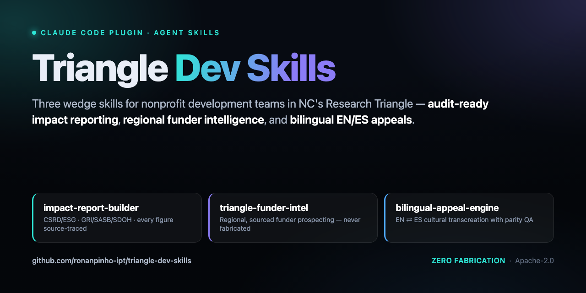
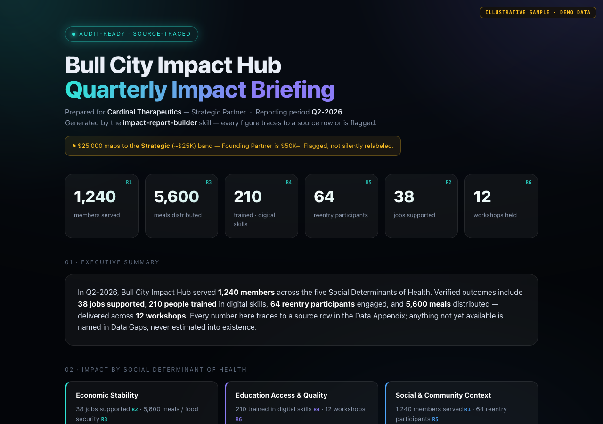

<p align="center">
  <a href="LICENSE"></a>
  
  
  
  
</p>

# Triangle Dev Skills

**Agent Skills for nonprofit development teams in North Carolina's Research
Triangle** — Raleigh, Durham, and Chapel Hill.

Most nonprofit AI skills are US-national-generic, EU-flavored (CSRD/GRI tooling
built for corporates), or built around grant mechanics that any region shares.
This plugin does the opposite: it encodes the three jobs that are hardest for a
Triangle-area development shop to do well and that no existing skill does at
all — **audit-ready impact data**, **regional funder intelligence**, and
**bilingual (EN/ES) donor appeals**. Three focused wedge skills, one shared
knowledge base, one org brief auto-loaded into every session.

## The three skills

| Skill | What it does | Why it's the wedge |
|---|---|---|
| **`impact-report-builder`** | Normalizes member/program metrics to GRI / SASB / TCFD / SDOH categories and drafts a quarterly, **audit-ready** partner-briefing packet tied to a specific sponsorship-tier promise. Every figure traces to a source row or is flagged in an explicit **Data Gaps** section. | The CSRD/ESG era is making hand-wavey impact reporting unsustainable. Existing skills do narrative storytelling only — none build the *verified, normalized, audit-ready data layer* a corporate partner's ESG officer will actually accept. |
| **`triangle-funder-intel`** | Scores your org against a *verified* Triangle/NC funder seed list (mission fit · geography · ask-size band · giving history · warm path) and researches new prospects live, with sources. | Regional moat. National-generic prospect tools miss RTP corporate sponsors and NC community/family foundations. Geography is the differentiator. |
| **`bilingual-appeal-engine`** | Transcreates donor appeals, emails, and posts between English and Spanish — cultural transcreation, not literal translation — with a parity-QA pass and a cultural-notes section. | Triangle Latino philanthropy is growing and underserved. Bilingual donor communication is a distinct craft, and effectively no nonprofit skill does it. |

All three read and write a **shared knowledge base** (`shared-kb/`), so a fact
captured once is reused everywhere: funder-intel feeds the grant pipeline, the
impact-report builder fulfills the tier promise, and the bilingual engine quotes
only verified outcomes. See [`shared-kb/README.md`](shared-kb/README.md).

## See it in action

`impact-report-builder` turns a handful of raw member metrics into a board-grade,
framework-mapped, **audit-ready** partner briefing — every figure traced to a
source row, every gap surfaced rather than invented:



> Full rendered sample: [`examples/sample-impact-briefing.html`](examples/sample-impact-briefing.html). Organizations and figures are illustrative/synthetic.

## Why niched for the Triangle

The Research Triangle has a specific philanthropic shape: a dense corporate base
in Research Triangle Park, a cluster of NC community and family foundations, a
fast-growing Latino business community, and a wave of corporate partners now
asking for ESG-grade, verifiable impact data. A national-generic skill set
serves none of those specifics. This plugin treats them as first-class.

## Zero fabrication

These skills never invent a funder, grant amount, deadline, donor, statistic, or
impact number. Where a real value is not yet verified, they write a clearly
marked `<VERIFY: ...>` placeholder. The funder seed list contains **verified
entries only**, each with a source URL. "Audit-ready" is the whole point: every
number is sourced or visibly flagged.

## Install

This is a Claude Code plugin distributed via a plugin marketplace.

```shell
/plugin marketplace add ronanpinho-ipt/triangle-dev-skills
/plugin install triangle-dev@triangle-dev-skills
```

Or add a local clone:

```shell
git clone https://github.com/ronanpinho-ipt/triangle-dev-skills
/plugin marketplace add ./triangle-dev-skills
/plugin install triangle-dev@triangle-dev-skills
```

After installing, copy the org brief template and fill it in:

```shell
cp shared-kb/impact-brief.template.md shared-kb/impact-brief.md
# then replace every <FILL IN: ...> placeholder with a verified value
```

A `SessionStart` hook loads `shared-kb/impact-brief.md` into every session, so
the skills start with your org's mission, programs, outcomes, funder landscape,
and tier promises already in context. See
[`hooks/session-start.md`](hooks/session-start.md).

## Repository layout

```
triangle-dev-skills/
├── .claude-plugin/marketplace.json     # marketplace catalog
├── plugins/triangle-dev/
│   ├── .claude-plugin/plugin.json      # plugin manifest (the 3 skills)
│   └── skills/
│       ├── impact-report-builder/
│       ├── triangle-funder-intel/
│       └── bilingual-appeal-engine/
├── shared-kb/                          # the spine: brief + canonical KB folders
│   ├── README.md
│   └── impact-brief.template.md
├── hooks/                              # SessionStart hook that loads the brief
│   ├── hooks.json
│   ├── load-impact-brief.sh
│   └── session-start.md
├── README.md
└── LICENSE
```

## Built from real work

These skills aren't theoretical. Their workflows were shaped by real engagements
with Triangle-area nonprofit development teams wrestling with the same three
problems: corporate partners demanding ESG-grade, *verifiable* impact data;
funder research that has to be regional to be worth anything; and a fast-growing
Latino donor base that English-only outreach never reaches. The plugin encodes
what actually worked in that work — distilled into repeatable workflows. Every
example shipped here uses anonymized organizations and synthetic figures.

## License

Apache License 2.0. See [`LICENSE`](LICENSE). Copyright 2026 Ronan Pinho.
